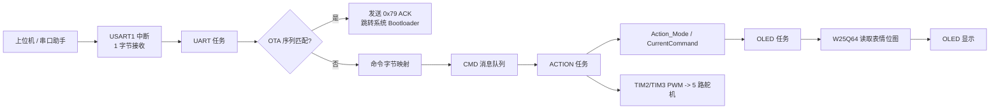

# hal10

基于 `STM32F103C8T6`、`STM32 HAL` 和 `FreeRTOS` 的桌面机器人控制工程。系统通过 `USART1` 接收上位机发送的单字节情绪命令，驱动 5 路舵机执行动作，同时从外部 `W25Q64` SPI Flash 读取表情位图并显示在 `128x64 OLED` 上。

这个仓库同时包含：

- `Core/` 下由 STM32CubeMX 生成和维护的外设初始化、HAL 中断、FreeRTOS 框架代码
- `BSP/` 下的业务逻辑，包括动作控制、命令映射、OLED 显示、W25Q64 驱动、UART 封装和 OTA 跳转 bootloader
- `hal10.ioc`，用于在 STM32CubeMX 中查看和再生成工程配置
- `MDK-ARM/hal10.uvprojx`，用于在 Keil MDK-ARM 中直接编译下载

## 功能概览

- 5 路舵机 PWM 控制
- 128x64 OLED 表情显示
- 外部 W25Q64 Flash 存储表情位图
- FreeRTOS 多任务调度
- UART 单字节命令协议
- UART 触发系统 Bootloader 的升级入口

## 硬件资源与接线

### MCU 与时钟

- MCU: `STM32F103C8T6`
- 系统时钟: `72 MHz`
- HSE: `PD0/PD1`
- LSE: `PC14/PC15`
- SWD: `PA13/PA14`

### 引脚分配

| 功能 | 引脚 | 外设 | 说明 |
| --- | --- | --- | --- |
| 左上舵机 | `PA0` | `TIM2_CH1` | 腿部舵机 1 |
| 右上舵机 | `PA1` | `TIM2_CH2` | 腿部舵机 2，软件中做了角度反向 |
| 左下舵机 | `PA2` | `TIM2_CH3` | 腿部舵机 3 |
| 右下舵机 | `PA3` | `TIM2_CH4` | 腿部舵机 4，软件中做了角度反向 |
| W25Q64 CS | `PA4` | GPIO 输出 | 片选，默认上拉置高 |
| W25Q64 SCK | `PA5` | `SPI1_SCK` | SPI 时钟 |
| W25Q64 MISO | `PA6` | `SPI1_MISO` | SPI 输入 |
| W25Q64 MOSI | `PA7` | `SPI1_MOSI` | SPI 输出 |
| UART TX | `PA9` | `USART1_TX` | 调试输出 / 命令回显 |
| UART RX | `PA10` | `USART1_RX` | 接收控制命令 / OTA 触发序列 |
| 尾巴舵机 | `PB4` | `TIM3_CH1` | 使用 TIM3 部分重映射 |
| OLED SCL | `PB6` | `I2C1_SCL` | 硬件 I2C |
| OLED SDA | `PB7` | `I2C1_SDA` | 硬件 I2C |

### 舵机布局

代码中的 4 个腿部舵机布局如下：

```text
1        2

3        4
```

- `Servo_1`: 左上
- `Servo_2`: 右上
- `Servo_3`: 左下
- `Servo_4`: 右下
- `Servo_5`: 尾巴

其中右侧舵机在软件里做了镜像补偿：

- `Servo_2(angle)` 实际输出为 `180 - angle`
- `Servo_4(angle)` 实际输出为 `180 - angle`

## 外设配置摘要

### PWM

- `TIM2` 控制 4 个腿部舵机
- `TIM3` 控制尾巴舵机
- 预分频 `71`
- 自动重装值 `20000 - 1`
- PWM 基准频率 `50 Hz`
- 脉宽换算公式：

```c
pulse = angle / 180 * 2000 + 500;
```

即代码按 `500us ~ 2500us` 映射 `0° ~ 180°`。

### I2C

- 外设：`I2C1`
- 引脚：`PB6/PB7`
- 速率：`400 kHz`
- 用途：驱动 OLED

### SPI

- 外设：`SPI1`
- 引脚：`PA5/PA6/PA7`
- 模式：主机模式、模式 0
- 分频：`/8`
- 代码中用于访问外部 `W25Q64`

### UART

- 外设：`USART1`
- 波特率：`115200`
- 数据位：`8`
- 停止位：`1`
- 校验：无
- 接收方式：`1 字节中断接收`
- 发送方式：阻塞式 `HAL_UART_Transmit`

## 软件架构

### 分层结构

| 目录 | 作用 |
| --- | --- |
| `Core/Inc` | CubeMX 生成的头文件 |
| `Core/Src` | 系统启动、外设初始化、中断、FreeRTOS 任务入口 |
| `BSP/action.*` | 舵机动作控制与动作状态机 |
| `BSP/command.*` | UART 命令到“表情 + 动作”的映射 |
| `BSP/bsp_oled_debug.*` | OLED 驱动与位图显示 |
| `BSP/w25q64.*` | W25Q64 SPI Flash 驱动 |
| `BSP/bsp_uart.*` | UART BSP 封装 |
| `BSP/bsp_ota_boot.*` | UART 触发系统 bootloader |

### FreeRTOS 任务与优先级

系统定义了 3 个任务和 1 个消息队列：

| 对象 | 优先级 | 作用 |
| --- | --- | --- |
| `UART` 任务 | `osPriorityNormal5` | 接收串口字节、解析 OTA 序列、投递动作命令 |
| `ACTION` 任务 | `osPriorityNormal3` | 执行动作状态机并持续输出舵机角度 |
| `OLED` 任务 | `osPriorityNormal1` | 根据当前命令刷新表情 |
| `CMD` 队列 | 长度 `16` | 传递 `CommandType_t` 指令 |

### 数据流



## 启动与运行逻辑

### 1. 上电启动

`main.c` 的启动顺序如下：

1. `HAL_Init()`
2. `SystemClock_Config()`，将系统时钟配置到 `72 MHz`
3. 初始化 `GPIO / I2C1 / SPI1 / TIM2 / TIM3 / USART1`
4. 启动 5 路 PWM 输出
5. 初始化 UART BSP
6. 初始化 FreeRTOS 内核、创建任务和消息队列
7. 启动调度器

### 2. 默认状态

- `ACTION` 任务启动后先执行 `Action_upright()`，让四肢进入站立姿态
- `OLED` 任务启动后初始化 OLED，并从外部 Flash 读取 `BMP4_STORAGE_ADDR` 处的默认表情
- `UART` 任务启动后打印启动信息，并开始 `HAL_UART_Receive_IT()` 单字节接收

### 3. 命令接收

`UART` 任务循环做两件事：

- 检查 `uart_rx_complete` 标志，处理新收到的 1 个字节
- 每 15 秒输出一次状态日志

串口收到字节后，先经过 OTA 匹配器：

- 如果在接收 `0x5A 0xA5 0x5A 0xA5` 序列，则进入静默窗口
- 匹配成功后发送 `0x79`，然后跳转到 STM32 系统 Bootloader
- 如果不是 OTA 序列，则按普通动作命令处理

### 4. 动作执行

普通命令会被转换成 `CommandType_t` 并放入 `CMD` 队列。`ACTION` 任务负责从队列读取命令并执行：

- 如果收到 `CMD_STOP`，则清空模式并回到站立
- 如果收到新命令，则先停止旧动作，再切换到新动作
- 如果收到与当前相同的命令，则仅重置开始时间

动作本身采用“非阻塞状态机”的实现方式：

- 每种循环动作对应一个 `ActionState_t`
- 通过 `current_step / total_steps / last_step_time / step_delay` 控制步进
- `ACTION` 任务每 `10 ms` 轮询一次，根据时间差决定是否推进一步

这种设计避免了在动作函数里长时间阻塞，FreeRTOS 任务切换更平滑。

### 5. 表情显示

OLED 任务并不消费消息队列，而是每 `100 ms` 轮询全局 `CurrentCommand`：

- 命令变化时，根据 `CommandMap` 查到对应表情地址
- 从 `W25Q64` 读取 `1024` 字节位图
- 清屏后重新绘制 `128x64` 表情
- `CMD_STOP` 或空闲状态会恢复默认表情 `BMP4`

## 命令协议

### 单字节动作命令

| UART 字节 | 指令 | 表情地址 | 动作模式 | 说明 |
| --- | --- | --- | --- | --- |
| `0x11` | `CMD_HAPPY` | `BMP3` | `MODE_ADVANCE` | 开心 + 前进 |
| `0x22` | `CMD_SAD` | `BMP6` | `MODE_SIT` | 悲伤 + 坐下 |
| `0x33` | `CMD_ANGRY` | `BMP9` | `MODE_STAND` | 生气 + 站立 |
| `0x44` | `CMD_SURPRISE` | `BMP13` | `MODE_LROTATION` | 惊讶 + 左转 |
| `0xBB` | `CMD_LOVE` | `BMP7` | `MODE_SWINGTAIL` | 爱心 + 摇尾巴 |
| `0x66` | `CMD_SHY` | `BMP16` | `MODE_RROTATION` | 害羞 + 右转 |
| `0x77` | `CMD_FEAR` | `BMP5` | `MODE_BACK` | 害怕 + 后退 |
| `0x88` | `CMD_RELAX` | `BMP2` | `MODE_RELAX` | 放松 + 放松趴姿 |
| `0x99` | `CMD_EXCITED` | `BMP13` | `MODE_SWING` | 激动 + 摇摆 |
| `0xCC` | `CMD_DOWN` | `BMP15` | `MODE_DOWN` | 悠闲 + 趴下 |
| `0xDD` | `CMD_STOP` | 无 | 停止 | 立即停止并恢复默认姿态/表情 |

### OTA 触发命令

| 序列 | 响应 | 行为 |
| --- | --- | --- |
| `0x5A 0xA5 0x5A 0xA5` | `0x79` | 跳转到 `0x1FFFF000` 系统 Bootloader |

## 动作实现方式

### 固定姿态

这些动作会直接设置 4 个腿部舵机角度：

- `Action_upright()`: `90, 90, 90, 90`
- `Action_sit()`: `90, 90, 20, 20`
- `Action_getdowm()`: `20, 20, 20, 20`
- `Action_relaxed_getdowm()`: `20, 20, 160, 160`

### 循环步进动作

这些动作按步骤循环输出角度：

- `Action_advance()`: 8 步前进步态
- `Action_back()`: 8 步后退步态
- `Action_Lrotation()`: 4 步左转
- `Action_Rrotation()`: 4 步右转
- `Action_Swing()`: 所有腿在 `30° ~ 149°` 间摇摆
- `Action_SwingTail()`: 尾巴在 `30° ~ 149°` 间摇摆

### 实现特点

- 步态函数本身不阻塞，只在到达 `step_delay` 时推进下一步
- `SwingDelay = 8 ms`
- `SpeedDelay = 200 ms`
- 右侧舵机做镜像补偿，因此动作表里可用统一角度语义描述左右腿

## 表情资源存储方式

OLED 表情图存放在外部 `W25Q64` 中：

- 单张大小：`1024 bytes`
- 分辨率：`128x64`
- 每张地址步进：`0x400`
- 已预留 `BMP1 ~ BMP18`

示例地址：

- `BMP1 = 0x000000`
- `BMP2 = 0x000400`
- `BMP3 = 0x000800`
- ...
- `BMP18 = 0x004400`

也就是说，当前仓库默认假设表情资源已经被预先烧录进外部 Flash；如果 Flash 中没有这些位图，OLED 显示内容将不可预期。

## OTA / Bootloader 机制

`BSP/bsp_ota_boot.c` 实现了一个很轻量的 UART 升级入口：

1. 按字节匹配 `0x5A 0xA5 0x5A 0xA5`
2. 匹配期间开启 `1000 ms` 静默窗口，避免其他调试输出干扰升级
3. 匹配成功后发送 `0x79`
4. 停止 UART 接收和全部 PWM 输出
5. `HAL_RCC_DeInit()` + `HAL_DeInit()`
6. 关闭中断、清空 SysTick、切换 `VTOR`
7. 跳转到 STM32 系统存储区 Bootloader

这意味着上位机可以不依赖自定义应用协议，直接通过串口切到官方 bootloader 做后续下载。

## 目录结构

```text
hal10/
├─ BSP/
│  ├─ action.c/h
│  ├─ command.c/h
│  ├─ bsp_uart.c/h
│  ├─ bsp_ota_boot.c/h
│  ├─ bsp_oled_debug.c/h
│  ├─ bsp_oled_codetab.c/h
│  └─ w25q64.c/h
├─ Core/
│  ├─ Inc/
│  └─ Src/
├─ Drivers/
├─ Middlewares/
├─ MDK-ARM/
├─ hal10.ioc
└─ README.md
```

## 构建与开发

### 推荐环境

- `STM32CubeMX 6.16.1`
- `STM32Cube FW_F1 V1.8.7`
- `Keil MDK-ARM V5.32`

